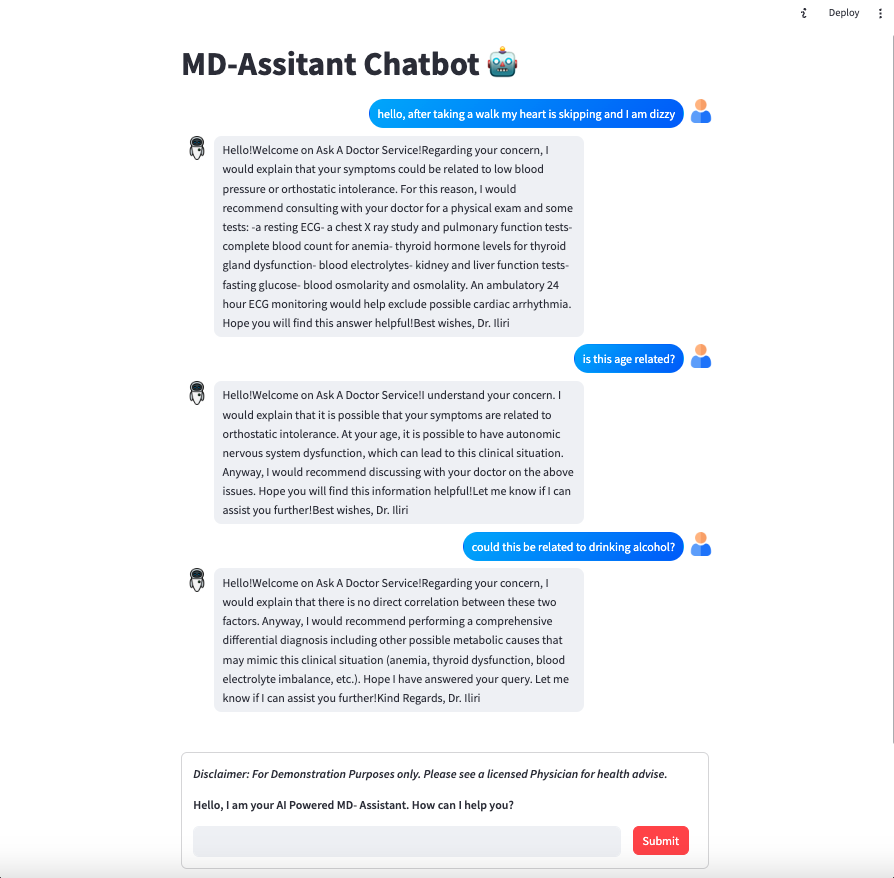

## LLAMA 2 Finetuned as MD Assistant Agent with Streamlit Chatbot UI
Finetuning LLAMA 2 model to assist Doctors in clinical scenarios.

*Important:* This conversational AI model is not intended to provide medical advice or diagnose medical conditions. It is solely designed to assist with generating hypothetical patient scenarios for educational purposes. Any information provided by this model should not be considered medical advice or substitute for professional medical judgment. If you have any health concerns or symptoms, we strongly encourage you to seek advice from a qualified healthcare professional. Only licensed physicians and medical professionals are trained and authorized to provide medical advice and treatment. Use of this model does not establish a doctor-patient relationship. We disclaim any warranty or liability for damages resulting from the use of this model, including but not limited to direct, indirect, incidental, punitive, and consequential damages.

## About the fine-tuning dataset ##
First introduced in a 2004 paper by Xuehai He et al., MedDialog consists of two large-scale medical dialogue datasets that capture conversations between patients and doctors across various medical domains.

What makes MedDialog particularly interesting for business applications is its scope and diversity. The dataset contains over 250,000 utterances from both patients and doctors, spanning 51 different medical categories and 96 specialties. This wealth of information provides a unique opportunity for machine learning models to learn patterns and relationships within medical dialogues, which can ultimately enhance decision-making processes in healthcare settings.

Developing conversational AI systems that can facilitate patient-doctor interactions using clinic or provider specific dialog datasets is a valid use case. By analyzing the language used in medical consultations, these systems can better understand patient concerns and provide personalized recommendations for treatment options. This not only improves patient satisfaction but also streamlines the consultation process for doctors, allowing them to focus on more complex cases.

Actual fine-tuning projects that involve any medical/clinical data would have to be anonymized in compliance HIPAA.

For a detailed walkthrough, subscribe to https://nexusnotes.blog and find the blog about this codebase.

